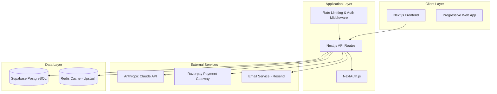

# Design Document: VIVK MVP

## Overview

VIVK (Virtual Intelligent Versatile Knowledge) is an AI-powered assistant platform built specifically for the Indian market. The MVP provides a complete chat-based AI assistant with user authentication, subscription management, and usage tracking. The system is designed to be cost-effective, scalable, and optimized for the Indian market with affordable pricing tiers.

The architecture follows a modern full-stack approach using Next.js 14 with App Router for both frontend and backend, PostgreSQL for data persistence, and Anthropic's Claude API for AI capabilities. The system supports three subscription tiers with different AI models and usage limits.

## Architecture

### High-Level Architecture



### Technology Stack Decisions

**Frontend & Backend: Next.js 14 with App Router**
- **Reasoning**: App Router provides better performance with Server Components, built-in streaming, and improved developer experience. Perfect for AI chat applications requiring real-time updates.
- **Benefits**: Single codebase for frontend/backend, excellent Vercel integration, built-in API routes, streaming support for AI responses.

**Database: Supabase PostgreSQL**
- **Reasoning**: Supabase offers generous free tier (500MB storage, 2GB bandwidth), built-in auth integration, real-time subscriptions, and excellent Next.js compatibility.
- **Benefits**: Free tier covers MVP needs, built-in auth, real-time features, automatic backups, easy scaling.

**Authentication: NextAuth.js v5**
- **Reasoning**: Open-source, no vendor lock-in, excellent Next.js App Router support, supports multiple providers, and handles JWT/session management.
- **Benefits**: Cost-effective (free), flexible, secure, supports email/password + OAuth, active community.

**AI Integration: Anthropic Claude API**
- **Reasoning**: As specified, using Claude Haiku for free users and Claude Sonnet for paid users.
- **Benefits**: High-quality responses, streaming support, competitive pricing, good rate limits.

**Payments: Razorpay**
- **Reasoning**: Leading Indian payment gateway with comprehensive features, good documentation, and webhook support.
- **Benefits**: Indian market focus, multiple payment methods, recurring billing, good developer experience.

**Caching: Upstash Redis**
- **Reasoning**: Serverless Redis with generous free tier, perfect for rate limiting and session caching.
- **Benefits**: Free tier (10K requests/day), serverless, low latency, easy integration.

## Components and Interfaces

### Core Components

#### 1. Authentication System
```typescript
interface AuthService {
  signUp(email: string, password: string): Promise<AuthResult>
  signIn(email: string, password: string): Promise<AuthResult>
  signOut(): Promise<void>
  resetPassword(email: string): Promise<void>
  verifyEmail(token: string): Promise<boolean>
}

interface User {
  id: string
  email: string
  emailVerified: boolean
  subscriptionTier: 'free' | 'pro' | 'business'
  subscriptionStatus: 'active' | 'cancelled' | 'expired'
  createdAt: Date
  updatedAt: Date
}
```

#### 2. Chat System
```typescript
interface ChatService {
  createConversation(userId: string): Promise<Conversation>
  sendMessage(conversationId: string, content: string): Promise<Message>
  getConversations(userId: string): Promise<Conversation[]>
  getMessages(conversationId: string): Promise<Message[]>
  streamResponse(message: string, model: string): AsyncIterable<string>
}

interface Conversation {
  id: string
  userId: string
  title: string
  createdAt: Date
  updatedAt: Date
  messageCount: number
}

interface Message {
  id: string
  conversationId: string
  role: 'user' | 'assistant'
  content: string
  createdAt: Date
  tokens?: number
}
```

#### 3. Subscription Management
```typescript
interface SubscriptionService {
  createSubscription(userId: string, plan: SubscriptionPlan): Promise<PaymentIntent>
  cancelSubscription(userId: string): Promise<void>
  upgradeSubscription(userId: string, newPlan: SubscriptionPlan): Promise<PaymentIntent>
  handleWebhook(payload: RazorpayWebhook): Promise<void>
  getUsageStats(userId: string): Promise<UsageStats>
}

interface SubscriptionPlan {
  id: 'free' | 'pro' | 'business'
  name: string
  price: number
  currency: 'INR'
  features: {
    dailyMessageLimit?: number
    aiModel: 'claude-haiku' | 'claude-sonnet'
    teamFeatures: boolean
  }
}

interface UsageStats {
  dailyMessages: number
  monthlyMessages: number
  dailyLimit?: number
  resetTime: Date
}
```

#### 4. AI Integration
```typescript
interface AIService {
  generateResponse(
    messages: Message[],
    model: 'claude-haiku' | 'claude-sonnet',
    stream?: boolean
  ): Promise<string> | AsyncIterable<string>
  
  estimateTokens(content: string): number
  validateModel(subscriptionTier: string): string
}
```

### API Routes Structure

```
/api/
├── auth/
│   ├── signup/
│   ├── signin/
│   ├── signout/
│   ├── reset-password/
│   └── verify-email/
├── chat/
│   ├── conversations/
│   ├── messages/
│   └── stream/
├── subscription/
│   ├── plans/
│   ├── create/
│   ├── cancel/
│   └── webhook/
├── user/
│   ├── profile/
│   ├── usage/
│   └── settings/
└── health/
```

## Data Models

### Database Schema

```sql
-- Users table
CREATE TABLE users (
  id UUID PRIMARY KEY DEFAULT gen_random_uuid(),
  email VARCHAR(255) UNIQUE NOT NULL,
  password_hash VARCHAR(255) NOT NULL,
  email_verified BOOLEAN DEFAULT FALSE,
  subscription_tier VARCHAR(20) DEFAULT 'free',
  subscription_status VARCHAR(20) DEFAULT 'active',
  subscription_id VARCHAR(255),
  subscription_expires_at TIMESTAMP,
  created_at TIMESTAMP DEFAULT NOW(),
  updated_at TIMESTAMP DEFAULT NOW()
);

-- Conversations table
CREATE TABLE conversations (
  id UUID PRIMARY KEY DEFAULT gen_random_uuid(),
  user_id UUID REFERENCES users(id) ON DELETE CASCADE,
  title VARCHAR(255) DEFAULT 'New Conversation',
  created_at TIMESTAMP DEFAULT NOW(),
  updated_at TIMESTAMP DEFAULT NOW()
);

-- Messages table
CREATE TABLE messages (
  id UUID PRIMARY KEY DEFAULT gen_random_uuid(),
  conversation_id UUID REFERENCES conversations(id) ON DELETE CASCADE,
  role VARCHAR(20) NOT NULL CHECK (role IN ('user', 'assistant')),
  content TEXT NOT NULL,
  tokens INTEGER,
  created_at TIMESTAMP DEFAULT NOW()
);

-- Usage logs table
CREATE TABLE usage_logs (
  id UUID PRIMARY KEY DEFAULT gen_random_uuid(),
  user_id UUID REFERENCES users(id) ON DELETE CASCADE,
  date DATE NOT NULL,
  message_count INTEGER DEFAULT 0,
  tokens_used INTEGER DEFAULT 0,
  created_at TIMESTAMP DEFAULT NOW(),
  UNIQUE(user_id, date)
);

-- Subscriptions table
CREATE TABLE subscriptions (
  id UUID PRIMARY KEY DEFAULT gen_random_uuid(),
  user_id UUID REFERENCES users(id) ON DELETE CASCADE,
  razorpay_subscription_id VARCHAR(255) UNIQUE,
  plan_id VARCHAR(50) NOT NULL,
  status VARCHAR(20) NOT NULL,
  current_period_start TIMESTAMP,
  current_period_end TIMESTAMP,
  created_at TIMESTAMP DEFAULT NOW(),
  updated_at TIMESTAMP DEFAULT NOW()
);

-- Payment history table
CREATE TABLE payments (
  id UUID PRIMARY KEY DEFAULT gen_random_uuid(),
  user_id UUID REFERENCES users(id) ON DELETE CASCADE,
  razorpay_payment_id VARCHAR(255) UNIQUE,
  amount INTEGER NOT NULL,
  currency VARCHAR(3) DEFAULT 'INR',
  status VARCHAR(20) NOT NULL,
  created_at TIMESTAMP DEFAULT NOW()
);

-- Indexes for performance
CREATE INDEX idx_conversations_user_id ON conversations(user_id);
CREATE INDEX idx_messages_conversation_id ON messages(conversation_id);
CREATE INDEX idx_usage_logs_user_date ON usage_logs(user_id, date);
CREATE INDEX idx_subscriptions_user_id ON subscriptions(user_id);
CREATE INDEX idx_payments_user_id ON payments(user_id);
```

### Data Relationships

- **Users** have many **Conversations** (1:N)
- **Conversations** have many **Messages** (1:N)
- **Users** have many **Usage Logs** (1:N)
- **Users** have one **Subscription** (1:1)
- **Users** have many **Payments** (1:N)

## Correctness Properties

*A property is a characteristic or behavior that should hold true across all valid executions of a system—essentially, a formal statement about what the system should do. Properties serve as the bridge between human-readable specifications and machine-verifiable correctness guarantees.*

### Property Reflection

After analyzing all acceptance criteria, I identified several areas where properties can be consolidated:

- Authentication properties (1.1-1.7) can be grouped into registration, login, and password reset properties
- Chat interface properties (2.1-2.7) focus on message handling and UI state management
- Usage tracking properties (5.1-5.7) can be consolidated around daily limits and counter management
- Payment properties (6.1-6.7) center around payment processing and subscription state changes

The following properties eliminate redundancy while maintaining comprehensive coverage:

### Property 1: User Registration Validation
*For any* valid email and password combination, user registration should create a new account, send verification email, and prevent duplicate registrations with existing emails
**Validates: Requirements 1.1, 1.2**

### Property 2: Authentication Session Management
*For any* user with valid credentials, login should create a secure JWT session, while invalid credentials should be rejected with appropriate error messages
**Validates: Requirements 1.3, 1.4, 1.7**

### Property 3: Password Reset Round Trip
*For any* registered user, requesting password reset should send a secure link, and using that link should allow password update
**Validates: Requirements 1.5, 1.6**

### Property 4: Message Display and Context Preservation
*For any* user message sent in a conversation, it should be immediately displayed and conversation context should be maintained throughout the session
**Validates: Requirements 2.1, 2.5**

### Property 5: AI Response Processing
*For any* AI response generation, the system should show typing indicator during processing, display responses with visual distinction from user messages, and handle API errors gracefully
**Validates: Requirements 2.2, 2.3, 2.6**

### Property 6: Conversation Management Persistence
*For any* conversation created or accessed, it should have a unique identifier, persist to database immediately, and load complete message history when selected
**Validates: Requirements 3.1, 3.2, 3.6**

### Property 7: Subscription Tier AI Model Assignment
*For any* user message, free tier users should receive Claude Haiku responses while Pro/Business tier users should receive Claude Sonnet responses
**Validates: Requirements 4.2, 4.3**

### Property 8: Usage Limit Enforcement
*For any* free tier user, daily message count should be tracked accurately, prevent messages after 20 per day, reset at midnight IST, and display appropriate warnings and limits
**Validates: Requirements 5.1, 5.2, 5.3, 5.4**

### Property 9: Payment Processing State Changes
*For any* payment attempt, successful payments should immediately upgrade subscription tier, failed payments should maintain current subscription with error messages, and payment history should be stored
**Validates: Requirements 6.1, 6.2, 6.3, 6.6**

### Property 10: Subscription Lifecycle Management
*For any* subscription change, upgrades should apply immediately, downgrades should apply at next billing cycle, and cancellations should maintain access until period end
**Validates: Requirements 4.5, 4.6, 6.5**

### Property 11: Dashboard Information Display
*For any* user accessing the dashboard, it should display current subscription status, usage statistics, conversation list, and billing information for paid users
**Validates: Requirements 7.1, 7.2, 7.3, 7.5, 7.7**

### Property 12: Data Security and Input Validation
*For any* user input or password, the system should hash/salt passwords before storage, validate and sanitize inputs to prevent injection attacks, and use HTTPS for all communications
**Validates: Requirements 8.2, 8.3, 8.4**

### Property 13: Error Handling and User Experience
*For any* system error (API failures, database issues, expired sessions), the system should display user-friendly messages, log errors without exposing technical details, and provide retry options where appropriate
**Validates: Requirements 9.1, 9.2, 9.3, 9.4, 9.5**

### Property 14: Rate Limiting and Caching
*For any* user request, the system should implement rate limiting to prevent abuse, use caching for frequently accessed data, and serve static assets from CDN
**Validates: Requirements 10.3, 10.5, 10.6**

## Error Handling

### Error Categories and Responses

#### 1. Authentication Errors
- **Invalid credentials**: Clear error message, no account lockout on MVP
- **Email already exists**: Friendly message suggesting login instead
- **Email verification required**: Clear instructions with resend option
- **Session expired**: Automatic redirect to login with explanation

#### 2. AI Service Errors
- **Claude API unavailable**: "AI service temporarily unavailable, please try again"
- **Rate limit exceeded**: "Too many requests, please wait before trying again"
- **Invalid response**: "Unable to generate response, please try again"
- **Timeout**: "Response taking longer than expected, please retry"

#### 3. Payment Errors
- **Payment failed**: Specific error from Razorpay with resolution steps
- **Subscription expired**: Grace period with upgrade prompts
- **Webhook failures**: Automatic retry with exponential backoff

#### 4. Usage Limit Errors
- **Daily limit reached**: Clear message with upgrade options and reset time
- **Approaching limit**: Warning at 15/20 messages with upgrade suggestion

#### 5. Database Errors
- **Connection issues**: Automatic retry with exponential backoff
- **Query failures**: Graceful degradation where possible
- **Data consistency**: Transaction rollback with user notification

### Error Logging Strategy

```typescript
interface ErrorLog {
  id: string
  userId?: string
  errorType: string
  errorMessage: string
  stackTrace: string
  requestId: string
  timestamp: Date
  userAgent?: string
  ipAddress?: string
}
```

## Testing Strategy

### Dual Testing Approach

The testing strategy combines unit tests for specific examples and edge cases with property-based tests for universal correctness properties. This dual approach ensures both concrete functionality and general system behavior are validated.

**Unit Testing Focus:**
- Specific authentication flows (signup, login, password reset)
- Payment webhook handling with known payloads
- Edge cases like empty conversations, malformed inputs
- Integration points between components
- Error conditions with specific scenarios

**Property-Based Testing Focus:**
- Universal properties that hold for all inputs
- Authentication with randomly generated valid/invalid credentials
- Message handling across different conversation states
- Usage tracking with various user activity patterns
- Subscription state transitions with different payment scenarios

### Property-Based Testing Configuration

**Framework**: fast-check for TypeScript/JavaScript
**Configuration**: Minimum 100 iterations per property test
**Test Tagging**: Each property test must reference its design document property

Example test structure:
```typescript
// Feature: vivk-mvp, Property 1: User Registration Validation
test('user registration validation', () => {
  fc.assert(fc.property(
    fc.emailAddress(),
    fc.string({ minLength: 8 }),
    async (email, password) => {
      // Test registration creates account and prevents duplicates
    }
  ), { numRuns: 100 })
})
```

**Test Categories:**
- **Authentication Properties**: Registration, login, session management
- **Chat Properties**: Message handling, conversation management
- **Subscription Properties**: Tier management, payment processing
- **Usage Properties**: Limit enforcement, counter management
- **Security Properties**: Input validation, data protection

### Integration Testing

- **API endpoint testing**: All routes with various inputs
- **Database integration**: CRUD operations with real database
- **External service integration**: Claude API, Razorpay webhooks
- **End-to-end flows**: Complete user journeys from signup to chat

### Performance Testing

- **Load testing**: Simulate 100+ concurrent users
- **Response time validation**: API responses under 2 seconds
- **Database query optimization**: Monitor query performance
- **Memory usage**: Ensure no memory leaks in streaming responses